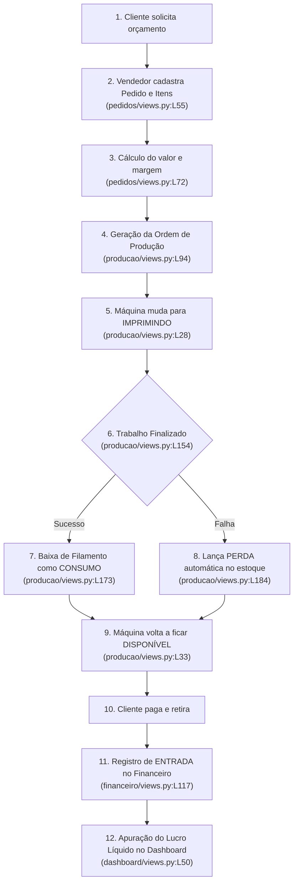

# Manual de Engenharia e Documentação do Sistema: FL3D Manager

> **Sistema Integrado de Gestão para Estúdios de Impressão 3D e Manufatura Aditiva**  
> **Versão:** 1.0.0  
> **Tecnologias:** Python 3.14+ | Django 5 | SQLite | Bootstrap 5 | HTML5 & JavaScript

---

## Sumário
1. [Visão Geral e Arquitetura](#1-visão-geral-e-arquitetura)
2. [Glossário de Impressão 3D e Engenharia de Software](#2-glossário-de-impressão-3d-e-engenharia-de-software)
3. [Mapeamento Completo de Ações, Arquivos e Linhas](#3-mapeamento-completo-de-ações-arquivos-e-linhas)
   - [3.1. Núcleo, Servidor e Inicialização](#31-núcleo-servidor-e-inicialização)
   - [3.2. Painel Inicial (Dashboard)](#32-painel-inicial-dashboard)
   - [3.3. Gestão de Clientes](#33-gestão-de-clientes)
   - [3.4. Catálogo de Produtos 3D](#34-catálogo-de-produtos-3d)
   - [3.5. Controle de Estoque de Filamentos](#35-controle-de-estoque-de-filamentos)
   - [3.6. Parque de Impressoras 3D](#36-parque-de-impressoras-3d)
   - [3.7. Vendas e Pedidos Comerciais](#37-vendas-e-pedidos-comerciais)
   - [3.8. Chão de Fábrica e Controle de Produção](#38-chão-de-fábrica-e-controle-de-produção)
   - [3.9. Gestão Financeira e Fluxo de Caixa](#39-gestão-financeira-e-fluxo-de-caixa)
   - [3.10. Relatórios e Análises](#310-relatórios-e-análises)
4. [Ciclo de Vida de uma Peça 3D (Do Pedido ao Lucro)](#4-ciclo-de-vida-de-uma-peça-3d-do-pedido-ao-lucro)
5. [Políticas de Segurança, Integridade e Auditoria](#5-políticas-de-segurança-integridade-e-auditoria)
6. [Guia de Operação e Manutenção](#6-guia-de-operação-e-manutenção)

---

## 1. Visão Geral e Arquitetura

O **FL3D Manager** foi desenvolvido sob medida para suprir os desafios específicos de uma empresa de impressão 3D (FDM - *Fused Deposition Modeling*). 

Diferente de um comércio tradicional onde itens prontos são comprados e revendidos, uma oficina de impressão 3D é uma mini-indústria:
- O estoque não é de produtos finais, mas de **bobinas de plástico (filamentos)** consumidas em gramas ($g$).
- As máquinas trabalham por horas a fio e demandam **acompanhamento de status, fila de impressão e manutenção periódica**.
- O preço de venda deve cobrir o **filamento consumido**, o **tempo de máquina**, o **consumo elétrico** e o **risco de falhas/perdas**.

### Padrão Arquitetural MVT (Model-View-Template)
O sistema adota o consagrado padrão do Django:
- **Model (Banco de Dados):** Estrutura das tabelas, regras de validação e integridade referencial.
- **View (Lógica de Negócio):** Regras de cálculo, controle de estoque, autorizações e processamento de formulários.
- **Template (Interface do Usuário):** Telas interativas em HTML5 renderizadas com componentes do Bootstrap 5.

---

## 2. Glossário de Impressão 3D e Engenharia de Software

### Termos de Impressão 3D
- **FDM (Fused Deposition Modeling):** Tecnologia de impressão 3D que constrói objetos camada por camada derretendo um fio de plástico.
- **Filamento:** O "rolo" ou "bobina" de plástico termoplástico utilizado pela máquina (geralmente vendido em carretéis de 1.000g / 1kg).
- **PLA, PETG, ABS:** Tipos de plástico:
  - *PLA:* Mais fácil de imprimir, biodegradável, ideal para peças decorativas e colecionáveis.
  - *PETG:* Mais resistente ao calor e a impactos, ideal para suportes funcionais e peças automotivas.
  - *ABS:* Muito resistente mecânica e termicamente, mas exige câmara fechada na impressora.
- **Fatiador (Slicer):** Programa de computador (ex: Bambu Studio, Cura, PrusaSlicer) que corta o arquivo 3D em camadas e gera o código de coordenadas (G-code). É dele que extraímos o **peso estimado (g)** e o **tempo previsto de impressão**.
- **Warping / Descolamento da Mesa:** Defeito onde a peça se solta do prato de vidro/PEI durante a impressão, gerando perda total de material.
- **Purga:** Quantidade de filamento expelida pelo bico na troca de carretel ou início de trabalho.

### Termos de Desenvolvimento Web
- **Model:** Arquivo em Python onde desenhamos a estrutura da tabela do banco de dados.
- **View:** Função ou classe que processa a requisição do usuário, executa regras e retorna a tela HTML pronta.
- **Soft Delete:** Prática recomendada em que um registro nunca é deletado do disco, apenas tem seu campo `ativo` alterado para `False`, preservando histórico fiscal e contábil.
- **FormSet:** Recurso avançado do Django que permite manipular múltiplos formulários (como os itens de um carrinho de compras) em uma única tela.

---

## 3. Mapeamento Completo de Ações, Arquivos e Linhas

Abaixo encontra-se o inventário minucioso de cada rotina, modelo, cálculo e regra de negócio do projeto, com a localização exata de arquivo e linha.

### 3.1. Núcleo, Servidor e Inicialização

| Ação / Funcionalidade | Arquivo | Linhas | Explicação Técnica |
| :--- | :--- | :--- | :--- |
| **Linha de Comando Principal** | `manage.py` | [L7-L23](file:///c:/dev/Projetos/FL3D%20Manager/manage.py#L7-L23) | Ponto de entrada para comandos do terminal (`runserver`, `migrate`, `createsuperuser`). |
| **Automação de Inicialização Windows** | `iniciar_sistema.bat` | [L1-L39](file:///c:/dev/Projetos/FL3D%20Manager/iniciar_sistema.bat#L1-L39) | Ativa o venv (L21), abre o navegador em 3 segundos (L26) e sobe o servidor na rede local `0.0.0.0:8000` (L38). |
| **Cálculo da Pasta Base do Projeto** | `fl3d_manager/settings.py` | [L29-L33](file:///c:/dev/Projetos/FL3D%20Manager/fl3d_manager/settings.py#L29-L33) | `BASE_DIR = Path(__file__).resolve().parent.parent` garante portabilidade em qualquer computador. |
| **Permissão de Acesso em Rede Local** | `fl3d_manager/settings.py` | [L45-L48](file:///c:/dev/Projetos/FL3D%20Manager/fl3d_manager/settings.py#L45-L48) | `ALLOWED_HOSTS = ['*']` possibilita acessar pelo celular ou tablet via Wi-Fi. |
| **Lista de Aplicativos Ativos** | `fl3d_manager/settings.py` | [L56-L75](file:///c:/dev/Projetos/FL3D%20Manager/fl3d_manager/settings.py#L56-L75) | Registro dos 10 módulos da FL3D Studio (`clientes`, `produtos`, `pedidos`, etc.). |
| **Banco de Dados SQLite** | `fl3d_manager/settings.py` | [L116-L121](file:///c:/dev/Projetos/FL3D%20Manager/fl3d_manager/settings.py#L116-L121) | Conexão local armazenada no arquivo `db.sqlite3`. |
| **Fuso Horário e Idioma Nacional** | `fl3d_manager/settings.py` | [L143-L151](file:///c:/dev/Projetos/FL3D%20Manager/fl3d_manager/settings.py#L143-L151) | `LANGUAGE_CODE = 'pt-br'` e `TIME_ZONE = 'America/Sao_Paulo'`. |
| **Pastas de Upload (Fotos e Arquivos)** | `fl3d_manager/settings.py` | [L162-L167](file:///c:/dev/Projetos/FL3D%20Manager/fl3d_manager/settings.py#L162-L167) | Diretórios `media/` e `static/`. |
| **Roteador Geral de URLs** | `fl3d_manager/urls.py` | [L30-L51](file:///c:/dev/Projetos/FL3D%20Manager/fl3d_manager/urls.py#L30-L51) | Mapeamento central dos módulos do sistema web. |
| **Serviço de Mídia em Desenvolvimento** | `fl3d_manager/urls.py` | [L53-L56](file:///c:/dev/Projetos/FL3D%20Manager/fl3d_manager/urls.py#L53-L56) | Libera a visualização das fotos de produtos e uploads durante os testes. |
| **Conectores de Servidor Web (WSGI/ASGI)** | `fl3d_manager/wsgi.py` e `asgi.py` | [wsgi.py:L1-L22](file:///c:/dev/Projetos/FL3D%20Manager/fl3d_manager/wsgi.py#L1-L22) / [asgi.py:L1-L23](file:///c:/dev/Projetos/FL3D%20Manager/fl3d_manager/asgi.py#L1-L23) | Portas de entrada síncrona e assíncrona para servidores em nuvem. |
| **Template Mestre Visual** | `templates/base.html` | [L1-L199](file:///c:/dev/Projetos/FL3D%20Manager/templates/base.html#L1-L199) | Layout padrão com cabeçalho, menu lateral (L64-L168) e bloco de conteúdo (L188-L190). |

---

### 3.2. Painel Inicial (Dashboard)

| Ação / Funcionalidade | Arquivo | Linhas | Explicação Técnica |
| :--- | :--- | :--- | :--- |
| **View Principal do Dashboard** | `dashboard/views.py` | [L30-L80](file:///c:/dev/Projetos/FL3D%20Manager/dashboard/views.py#L30-L80) | Classe `DashboardPrincipalView` que agrega os indicadores em tempo real. |
| **Cálculo de Pedidos do Mês** | `dashboard/views.py` | [L44-L48](file:///c:/dev/Projetos/FL3D%20Manager/dashboard/views.py#L44-L48) | Filtra pedidos com data entre o 1º dia do mês e hoje. |
| **Cálculo de Faturamento do Mês** | `dashboard/views.py` | [L50-L55](file:///c:/dev/Projetos/FL3D%20Manager/dashboard/views.py#L50-L55) | Soma (`Sum('valor')`) todas as movimentações do tipo `ENTRADA`. |
| **Contagem de Máquinas Imprimindo** | `dashboard/views.py` | [L57-L60](file:///c:/dev/Projetos/FL3D%20Manager/dashboard/views.py#L57-L60) | Conta ordens de produção com status `IMPRIMINDO`. |
| **Detecção de Filamento Acabando** | `dashboard/views.py` | [L62-L68](file:///c:/dev/Projetos/FL3D%20Manager/dashboard/views.py#L62-L68) | Identifica carretéis com peso atual $\le 20\%$ do peso inicial (`peso_atual / peso_inicial <= 0.2`). |
| **Listagem dos Últimos 5 Pedidos** | `dashboard/views.py` | [L70-L72](file:///c:/dev/Projetos/FL3D%20Manager/dashboard/views.py#L70-L72) | `order_by('-data_pedido')[:5]` para visão rápida de vendas. |
| **Fila de Peças em Impressão** | `dashboard/views.py` | [L74-L77](file:///c:/dev/Projetos/FL3D%20Manager/dashboard/views.py#L74-L77) | Lista produções em andamento por ordem de início. |
| **Rota da Página Inicial** | `dashboard/urls.py` | [L15-L22](file:///c:/dev/Projetos/FL3D%20Manager/dashboard/urls.py#L15-L22) | Mapeia o caminho raiz `''` para `DashboardPrincipalView`. |

---

### 3.3. Gestão de Clientes

| Ação / Funcionalidade | Arquivo | Linhas | Explicação Técnica |
| :--- | :--- | :--- | :--- |
| **Modelo da Tabela de Clientes** | `clientes/models.py` | [L24-L79](file:///c:/dev/Projetos/FL3D%20Manager/clientes/models.py#L24-L79) | Classe `Cliente` com dados pessoais, endereço e controle ativo. |
| **Campos de WhatsApp e E-mail** | `clientes/models.py` | [L39-L43](file:///c:/dev/Projetos/FL3D%20Manager/clientes/models.py#L39-L43) | Canais diretos de comunicação e envio de orçamentos. |
| **Campos de Endereço e CEP** | `clientes/models.py` | [L48-L64](file:///c:/dev/Projetos/FL3D%20Manager/clientes/models.py#L48-L64) | Dados completos para despacho de encomendas e fretes. |
| **Flag de Soft Delete (Ativo/Inativo)** | `clientes/models.py` | [L72-L75](file:///c:/dev/Projetos/FL3D%20Manager/clientes/models.py#L72-L75) | `ativo = models.BooleanField(default=True)` para exclusão segura. |
| **Formulário com Bootstrap 5** | `clientes/forms.py` | [L20-L45](file:///c:/dev/Projetos/FL3D%20Manager/clientes/forms.py#L20-L45) | `ClienteForm` aplicando `form-control` e `form-check-input`. |
| **Lista com Busca por Nome** | `clientes/views.py` | [L23-L41](file:///c:/dev/Projetos/FL3D%20Manager/clientes/views.py#L23-L41) | `ClienteListView` com paginação e filtro `nome__icontains`. |
| **Cadastro de Novo Cliente** | `clientes/views.py` | [L44-L58](file:///c:/dev/Projetos/FL3D%20Manager/clientes/views.py#L44-L58) | `ClienteCreateView` com disparo de mensagem flash de sucesso. |
| **Edição de Cadastro** | `clientes/views.py` | [L61-L75](file:///c:/dev/Projetos/FL3D%20Manager/clientes/views.py#L61-L75) | `ClienteUpdateView` para retificação de contatos e endereços. |
| **Ficha e Histórico de Compras** | `clientes/views.py` | [L78-L95](file:///c:/dev/Projetos/FL3D%20Manager/clientes/views.py#L78-L95) | `ClienteDetailView` trazendo os pedidos vinculados ordenados por data. |
| **Exclusão Suave (Soft Delete)** | `clientes/views.py` | [L98-L116](file:///c:/dev/Projetos/FL3D%20Manager/clientes/views.py#L98-L116) | `ClienteDeleteView`: desativa o registro (`cliente.ativo = False`) sem apagar do banco. |
| **Rotas de Acesso de Clientes** | `clientes/urls.py` | [L19-L33](file:///c:/dev/Projetos/FL3D%20Manager/clientes/urls.py#L19-L33) | URLs para listagem, novo, detalhe, editar e excluir. |
| **Painel de Controle Admin** | `clientes/admin.py` | [L14-L29](file:///c:/dev/Projetos/FL3D%20Manager/clientes/admin.py#L14-L29) | Exibição em colunas, filtros laterais por estado e busca por CPF/WhatsApp. |

---

### 3.4. Catálogo de Produtos 3D

| Ação / Funcionalidade | Arquivo | Linhas | Explicação Técnica |
| :--- | :--- | :--- | :--- |
| **Categorias de Produtos** | `produtos/models.py` | [L26-L41](file:///c:/dev/Projetos/FL3D%20Manager/produtos/models.py#L26-L41) | `CategoriaProduto` para organizar itens (Decoração, Utilitários, etc.). |
| **Ficha Cadastral do Produto** | `produtos/models.py` | [L44-L107](file:///c:/dev/Projetos/FL3D%20Manager/produtos/models.py#L44-L107) | `Produto` com nome, código SKU e descrição. |
| **Upload de Fotos da Peça** | `produtos/models.py` | [L67](file:///c:/dev/Projetos/FL3D%20Manager/produtos/models.py#L67) | `foto = models.ImageField(upload_to='produtos/')`. |
| **Métricas Técnicas do Fatiador** | `produtos/models.py` | [L72-L87](file:///c:/dev/Projetos/FL3D%20Manager/produtos/models.py#L72-L87) | Armazena peso previsto ($g$) e tempo estimado de impressão (`DurationField`). |
| **Engenharia de Custos e Preço** | `produtos/models.py` | [L89-L98](file:///c:/dev/Projetos/FL3D%20Manager/produtos/models.py#L89-L98) | Campos de custo estimado, preço de venda e margem de lucro (%). |
| **Formulário de Cadastro de Produto** | `produtos/forms.py` | [L16-L44](file:///c:/dev/Projetos/FL3D%20Manager/produtos/forms.py#L16-L44) | `ProdutoForm` estilizado com suporte a envio de arquivos de imagem. |
| **Busca Mista por Nome ou Código** | `produtos/views.py` | [L23-L41](file:///c:/dev/Projetos/FL3D%20Manager/produtos/views.py#L23-L41) | `ProdutoListView` filtrando com operador OU (`Q(nome) | Q(codigo)`). |
| **Cadastro e Edição de Peças** | `produtos/views.py` | [L44-L71](file:///c:/dev/Projetos/FL3D%20Manager/produtos/views.py#L44-L71) | `ProdutoCreateView` e `ProdutoUpdateView`. |
| **Soft Delete de Produto** | `produtos/views.py` | [L84-L101](file:///c:/dev/Projetos/FL3D%20Manager/produtos/views.py#L84-L101) | `ProdutoDeleteView` inativa a peça sem perder os pedidos antigos onde ela consta. |
| **Rotas do Catálogo** | `produtos/urls.py` | [L19-L33](file:///c:/dev/Projetos/FL3D%20Manager/produtos/urls.py#L19-L33) | Endereços para gerenciar produtos. |
| **Administração do Catálogo** | `produtos/admin.py` | [L13-L31](file:///c:/dev/Projetos/FL3D%20Manager/produtos/admin.py#L13-L31) | Registro de `Produto` e `CategoriaProduto` no Django Admin. |

---

### 3.5. Controle de Estoque de Filamentos

| Ação / Funcionalidade | Arquivo | Linhas | Explicação Técnica |
| :--- | :--- | :--- | :--- |
| **Tabela de Carretéis de Filamento** | `estoque/models.py` | [L28-L67](file:///c:/dev/Projetos/FL3D%20Manager/estoque/models.py#L28-L67) | `Filamento`: marca, material, cor, peso inicial, peso atual, custo por rolo. |
| **Livro-Razão de Movimentações** | `estoque/models.py` | [L70-L115](file:///c:/dev/Projetos/FL3D%20Manager/estoque/models.py#L70-L115) | `MovimentacaoEstoque`: histórico com tipos Entrada, Consumo, Perda e Ajuste. |
| **Proteção Contra Exclusão Acidental** | `estoque/models.py` | [L85](file:///c:/dev/Projetos/FL3D%20Manager/estoque/models.py#L85) | `on_delete=models.PROTECT` impede deletar carretel que já tenha histórico. |
| **Formulário Seguro de Filamento** | `estoque/forms.py` | [L19-L38](file:///c:/dev/Projetos/FL3D%20Manager/estoque/forms.py#L19-L38) | Oculta `peso_atual` para blindar alteração indevida de saldo. |
| **Formulário de Ajuste na Balança** | `estoque/forms.py` | [L41-L61](file:///c:/dev/Projetos/FL3D%20Manager/estoque/forms.py#L41-L61) | `AjusteEstoqueForm` recebe o peso real da balança física e a justificativa. |
| **Busca Múltipla no Estoque** | `estoque/views.py` | [L25-L47](file:///c:/dev/Projetos/FL3D%20Manager/estoque/views.py#L25-L47) | Filtra bobinas por Marca, Material ou Cor simultaneamente. |
| **Criação com Entrada Automática** | `estoque/views.py` | [L50-L86](file:///c:/dev/Projetos/FL3D%20Manager/estoque/views.py#L50-L86) | Define `peso_atual = peso_inicial` e grava a primeira movimentação de ENTRADA. |
| **Blindagem de Peso na Atualização** | `estoque/views.py` | [L89-L113](file:///c:/dev/Projetos/FL3D%20Manager/estoque/views.py#L89-L113) | Garante que o peso atual não seja adulterado durante edições normais. |
| **Cálculo da Barra de Vida do Carretel** | `estoque/views.py` | [L123-L136](file:///c:/dev/Projetos/FL3D%20Manager/estoque/views.py#L123-L136) | Calcula o percentual restante `(peso_atual / peso_inicial) * 100` para a barra visual. |
| **Cálculo e Registro de Ajuste Físico** | `estoque/views.py` | [L139-L188](file:///c:/dev/Projetos/FL3D%20Manager/estoque/views.py#L139-L188) | Calcula a diferença ($\Delta = \text{peso\_balança} - \text{peso\_anterior}$) e audita a movimentação. |
| **Rotas de Estoque** | `estoque/urls.py` | [L18-L33](file:///c:/dev/Projetos/FL3D%20Manager/estoque/urls.py#L18-L33) | Endereços de listagem, inclusão, detalhes e pesagem. |
| **Administração do Estoque** | `estoque/admin.py` | [L14-L35](file:///c:/dev/Projetos/FL3D%20Manager/estoque/admin.py#L14-L35) | Telas administrativas com filtros por material, marca e data. |

---

### 3.6. Parque de Impressoras 3D

| Ação / Funcionalidade | Arquivo | Linhas | Explicação Técnica |
| :--- | :--- | :--- | :--- |
| **Tabela de Impressoras 3D** | `impressoras/models.py` | [L26-L65](file:///c:/dev/Projetos/FL3D%20Manager/impressoras/models.py#L26-L65) | `Impressora`: fabricante, modelo, série, data de aquisição e status. |
| **Opções de Status da Máquina** | `impressoras/models.py` | [L31-L37](file:///c:/dev/Projetos/FL3D%20Manager/impressoras/models.py#L31-L37) | `DISPONIVEL`, `IMPRIMINDO`, `MANUTENCAO` e `INATIVA`. |
| **Formulário com Seletor de Data** | `impressoras/forms.py` | [L17-L38](file:///c:/dev/Projetos/FL3D%20Manager/impressoras/forms.py#L17-L38) | `ImpressoraForm` com calendário nativo no campo de aquisição. |
| **Lista de Máquinas da Oficina** | `impressoras/views.py` | [L22-L28](file:///c:/dev/Projetos/FL3D%20Manager/impressoras/views.py#L22-L28) | `ImpressoraListView` para visualização em cartões ou tabela. |
| **Histórico das Últimas 20 Impressões** | `impressoras/views.py` | [L54-L67](file:///c:/dev/Projetos/FL3D%20Manager/impressoras/views.py#L54-L67) | `ImpressoraDetailView` traz as últimas 20 ordens executadas pela máquina. |
| **Cadastro, Edição e Exclusão** | `impressoras/views.py` | [L31-L51](file:///c:/dev/Projetos/FL3D%20Manager/impressoras/views.py#L31-L51) / [L70-L80](file:///c:/dev/Projetos/FL3D%20Manager/impressoras/views.py#L70-L80) | Operações completas de CRUD para manutenção do maquinário. |
| **Edição Rápida no Django Admin** | `impressoras/admin.py` | [L15-L27](file:///c:/dev/Projetos/FL3D%20Manager/impressoras/admin.py#L15-L27) | `list_editable = ('status',)` permite alterar status sem abrir a ficha. |

---

### 3.7. Vendas e Pedidos Comerciais

| Ação / Funcionalidade | Arquivo | Linhas | Explicação Técnica |
| :--- | :--- | :--- | :--- |
| **Tabela Principal do Pedido** | `pedidos/models.py` | [L24-L96](file:///c:/dev/Projetos/FL3D%20Manager/pedidos/models.py#L24-L96) | `Pedido`: número automático, cliente, prazos, status, valores e pagamento. |
| **Formas e Status de Pagamento** | `pedidos/models.py` | [L41-L54](file:///c:/dev/Projetos/FL3D%20Manager/pedidos/models.py#L41-L54) | Suporte a PIX, Cartão, Dinheiro e estados Pendente, Parcial e Pago. |
| **Itens do Pedido (Carrinho)** | `pedidos/models.py` | [L99-L120](file:///c:/dev/Projetos/FL3D%20Manager/pedidos/models.py#L99-L120) | `ItemPedido`: quantidade, valor unitário e total por item vinculado via CASCADE. |
| **FormSet de Itens Dinâmicos** | `pedidos/forms.py` | [L59-L66](file:///c:/dev/Projetos/FL3D%20Manager/pedidos/forms.py#L59-L66) | `inlineformset_factory` permitindo adicionar múltiplos itens em lote. |
| **Filtros e Busca de Pedidos** | `pedidos/views.py` | [L24-L53](file:///c:/dev/Projetos/FL3D%20Manager/pedidos/views.py#L24-L53) | `PedidoListView` filtrando por número ou nome do cliente e status da ordem. |
| **Cálculo Automático do Valor Final** | `pedidos/views.py` | [L72-L78](file:///c:/dev/Projetos/FL3D%20Manager/pedidos/views.py#L72-L78) | $\text{Valor Final} = \sum(\text{Itens}) - \text{Desconto}$. |
| **Recálculo na Atualização** | `pedidos/views.py` | [L122-L132](file:///c:/dev/Projetos/FL3D%20Manager/pedidos/views.py#L122-L132) | Recalcula a soma de todas as linhas e subtrai o desconto ao editar. |
| **Cancelamento Lógico do Pedido** | `pedidos/views.py` | [L159-L170](file:///c:/dev/Projetos/FL3D%20Manager/pedidos/views.py#L159-L170) | `PedidoDeleteView`: altera status para `CANCELADO` sem apagar histórico. |
| **Itens Integrados no Admin** | `pedidos/admin.py` | [L15-L33](file:///c:/dev/Projetos/FL3D%20Manager/pedidos/admin.py#L15-L33) | `ItemPedidoInline` exibe as linhas de produtos diretamente na página do pedido. |

---

### 3.8. Chão de Fábrica e Controle de Produção

| Ação / Funcionalidade | Arquivo | Linhas | Explicação Técnica |
| :--- | :--- | :--- | :--- |
| **Tabela de Ordem de Produção (OP)** | `producao/models.py` | [L29-L77](file:///c:/dev/Projetos/FL3D%20Manager/producao/models.py#L29-L77) | `Producao`: liga pedido, produto, máquina, carretel, tempos e previsões. |
| **Tabela de Registro Real** | `producao/models.py` | [L80-L113](file:///c:/dev/Projetos/FL3D%20Manager/producao/models.py#L80-L113) | `RegistroImpressao`: aponta peso real ($g$), duração e resultado (Sucesso/Falha). |
| **Tabela de Perdas e Desperdícios** | `producao/models.py` | [L116-L152](file:///c:/dev/Projetos/FL3D%20Manager/producao/models.py#L116-L152) | `Perda`: motivos como bico entupido, peça soltou da mesa, teste, etc. |
| **Sincronização de Status da Máquina** | `producao/views.py` | [L28-L44](file:///c:/dev/Projetos/FL3D%20Manager/producao/views.py#L28-L44) | `_atualizar_status_impressora`: se a produção imprime, a máquina fica ocupada; se conclui ou falha, fica livre. |
| **Subtração Automática de Plástico** | `producao/views.py` | [L47-L79](file:///c:/dev/Projetos/FL3D%20Manager/producao/views.py#L47-L79) | `_registrar_movimentacao_estoque`: debita o peso exato e atualiza o carretel com rastreabilidade. |
| **Baixa por Sucesso de Produção** | `producao/views.py` | [L173-L183](file:///c:/dev/Projetos/FL3D%20Manager/producao/views.py#L173-L183) | Se a peça ficou boa, lança tipo `CONSUMO` e dá baixa no estoque. |
| **Tratamento Automático de Falhas** | `producao/views.py` | [L184-L203](file:///c:/dev/Projetos/FL3D%20Manager/producao/views.py#L184-L203) | Se a peça falhou, cria registro em `Perda` e debita no estoque como `PERDA`. |
| **Lançamento Manual de Perdas** | `producao/views.py` | [L223-L242](file:///c:/dev/Projetos/FL3D%20Manager/producao/views.py#L223-L242) | Permite registrar purgas de bico, sobras ou testes com baixa no estoque. |
| **Rotas de Chão de Fábrica** | `producao/urls.py` | [L19-L33](file:///c:/dev/Projetos/FL3D%20Manager/producao/urls.py#L19-L33) | Endereços para ordens, finalização de impressão e perdas. |

---

### 3.9. Gestão Financeira e Fluxo de Caixa

| Ação / Funcionalidade | Arquivo | Linhas | Explicação Técnica |
| :--- | :--- | :--- | :--- |
| **Tabela de Movimentações Financeiras** | `financeiro/models.py` | [L24-L65](file:///c:/dev/Projetos/FL3D%20Manager/financeiro/models.py#L24-L65) | `MovimentacaoFinanceira`: tipo (entrada/saída), categorias, valores e pedidos. |
| **Categorias Específicas de Impressão 3D** | `financeiro/models.py` | [L33-L47](file:///c:/dev/Projetos/FL3D%20Manager/financeiro/models.py#L33-L47) | Filamento, Energia, Embalagens, Fretes, Manutenção, Taxas e Vendas. |
| **Formulário com Calendário Interativo** | `financeiro/forms.py` | [L16-L37](file:///c:/dev/Projetos/FL3D%20Manager/financeiro/forms.py#L16-L37) | `MovimentacaoFinanceiraForm` para entradas e saídas de caixa. |
| **Cálculo de Lucro Líquido do Mês** | `financeiro/views.py` | [L29-L44](file:///c:/dev/Projetos/FL3D%20Manager/financeiro/views.py#L29-L44) | $\text{Lucro} = \sum(\text{Entradas}) - \sum(\text{Saídas})$ do mês corrente. |
| **Série Temporal de 6 Meses para Gráficos** | `financeiro/views.py` | [L46-L77](file:///c:/dev/Projetos/FL3D%20Manager/financeiro/views.py#L46-L77) | Monta dados mensais em JSON para gerar gráficos via Chart.js. |
| **Extrato com Totalizadores Dinâmicos** | `financeiro/views.py` | [L84-L119](file:///c:/dev/Projetos/FL3D%20Manager/financeiro/views.py#L84-L119) | `MovimentacaoFinanceiraListView` com somatório em tempo real dos filtros. |
| **Relatório Analítico e DRE por Categoria** | `financeiro/views.py` | [L157-L208](file:///c:/dev/Projetos/FL3D%20Manager/financeiro/views.py#L157-L208) | `RelatorioView`: totaliza receitas e detalha despesas por categoria de custo. |
| **Rotas do Módulo Financeiro** | `financeiro/urls.py` | [L19-L34](file:///c:/dev/Projetos/FL3D%20Manager/financeiro/urls.py#L19-L34) | Endereços de dashboard, lançamentos e relatórios. |

---

### 3.10. Relatórios e Análises

| Ação / Funcionalidade | Arquivo | Linhas | Explicação Técnica |
| :--- | :--- | :--- | :--- |
| **Configuração do Módulo de Relatórios** | `relatorios/apps.py` | [L1-L22](file:///c:/dev/Projetos/FL3D%20Manager/relatorios/apps.py#L1-L22) | Registra o módulo analítico no ecossistema Django. |
| **Estrutura para Exportações Futuras** | `relatorios/models.py` e `views.py` | [models.py:L1-L16](file:///c:/dev/Projetos/FL3D%20Manager/relatorios/models.py#L1-L16) / [views.py:L1-L16](file:///c:/dev/Projetos/FL3D%20Manager/relatorios/views.py#L1-L16) | Área modular reservada para relatórios consolidados em PDF e planilhas Excel. |

---

## 4. Ciclo de Vida de uma Peça 3D (Do Pedido ao Lucro)

A automação do FL3D Manager conecta todas as etapas do estúdio em uma esteira fluida:



---

## 5. Políticas de Segurança, Integridade e Auditoria

1. **Rastreabilidade Absoluta de Material:**
   - Nenhum usuário pode simplesmente digitar um peso novo no carretel. O campo `peso_atual` é protegido em `estoque/forms.py:L19` e `estoque/views.py:L95`. Toda variação passa obrigatoriamente por um lançamento auditado em `MovimentacaoEstoque`.
2. **Proteção Contra Apagamento Involuntário (Soft Delete):**
   - Clientes (`clientes/views.py:L104`) e Produtos (`produtos/views.py:L89`) não são deletados fisicamente do banco de dados quando excluídos. Eles têm o campo `ativo` marcado como `False`. Isso protege o histórico contábil e as notas de pedidos passados.
   - O banco de dados utiliza `on_delete=models.PROTECT` em chaves vitais para impedir falhas de integridade referencial.
3. **Controle de Sessão e Autenticação:**
   - Todas as telas exigem autenticação ativa através do `LoginRequiredMixin` do Django, protegendo dados comerciais, números de clientes e demonstrativos de faturamento contra acessos externos.

---

## 6. Guia de Operação e Manutenção

### Como rodar o sistema no dia a dia:
1. Dê um duplo clique no arquivo [`iniciar_sistema.bat`](file:///c:/dev/Projetos/FL3D%20Manager/iniciar_sistema.bat).
2. O terminal abrirá, ativará o ambiente virtual e iniciará o servidor automaticamente.
3. Seu navegador abrirá em 3 segundos no endereço [http://127.0.0.1:8000/](http://127.0.0.1:8000/).
4. Para acessar pelo celular conectado na mesma rede Wi-Fi, abra o navegador do celular e digite o endereço IP mostrado na tela preta (ex: `http://192.168.15.3:8000`).

### Como verificar a integridade do código após alterações:
Abra o terminal na pasta do projeto e execute:
```bash
.\venv\Scripts\python.exe manage.py check
```
Se a resposta for `System check identified no issues (0 silenced)`, tudo estará funcionando perfeitamente!
